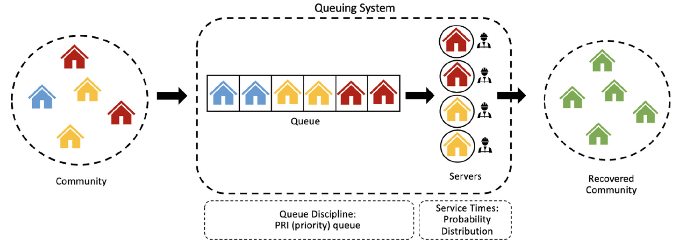

# Modeling housing recovery after the 2018 Lombok earthquakes using a stochastic queuing model
 

This repository contrians the code developed for the paper: 

[Alisjahbana, I., & Kiremidjian, A. (2020). Modeling housing recovery after the 2018 Lombok earthquakes using a stochastic queuing model. Earthquake Spectra, 8755293020970972.](https://journals.sagepub.com/doi/pdf/10.1177/8755293020970972)

Please cite the paper if you use any data or analyses from this study. 

